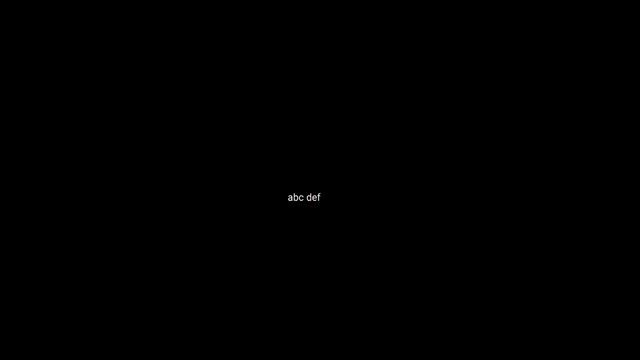
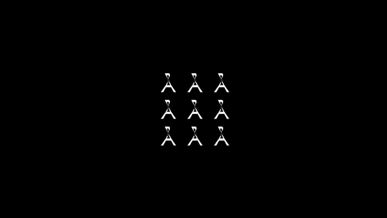
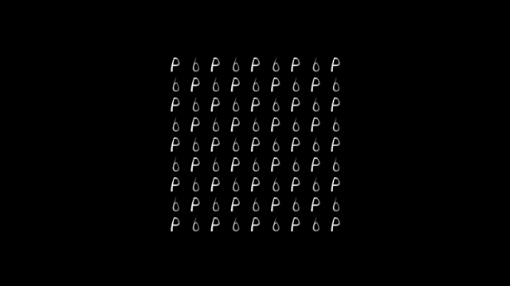

GitHub: [https://github.com/kenjiSpecial/tubugl-text](https://github.com/kenjiSpecial/tubugl-text)

### [#00 - procedural cube](./example00/index.html)

[codes](https://github.com/kenjiSpecial/tubugl-font/tree/master/examples/example00)

### [#01 - procedural cube](./example01/index.html)

[codes](https://github.com/kenjiSpecial/tubugl-font/tree/master/examples/example01)

### [#02 - procedural cube](./example02/index.html)

[codes](https://github.com/kenjiSpecial/tubugl-font/tree/master/examples/example02)

all examples were made with [tubugl](https://github.com/kenjiSpecial/tubugl)
